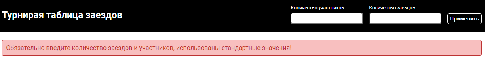
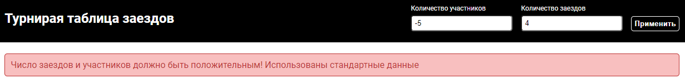
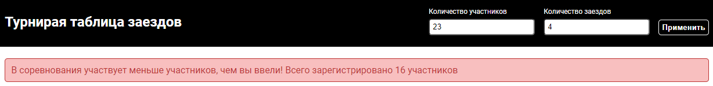
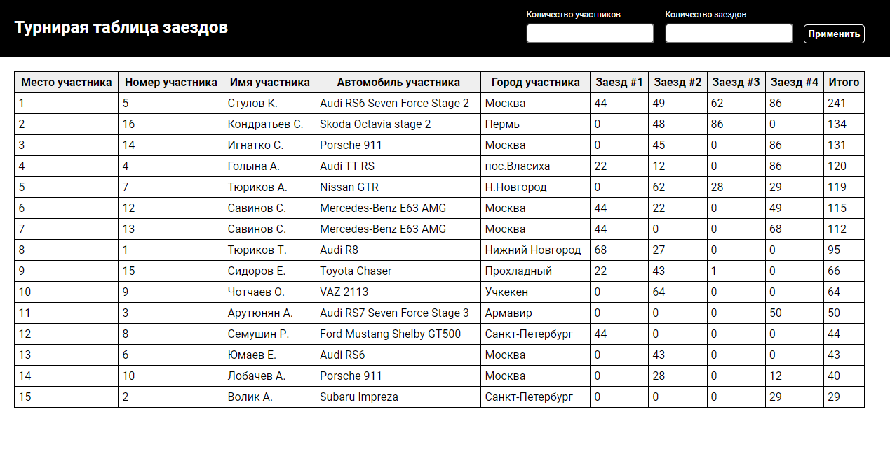
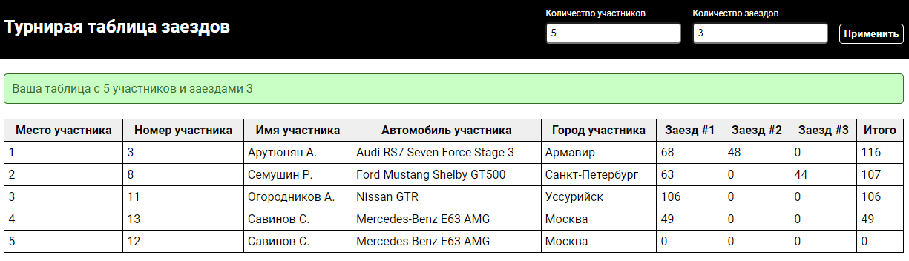
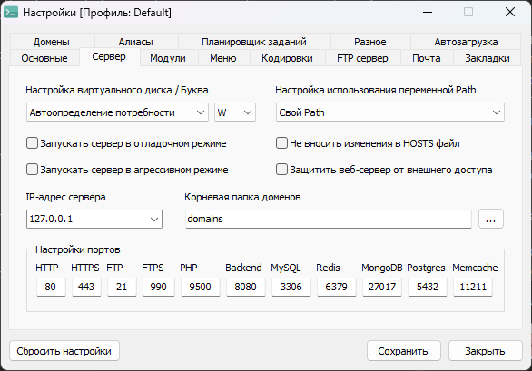
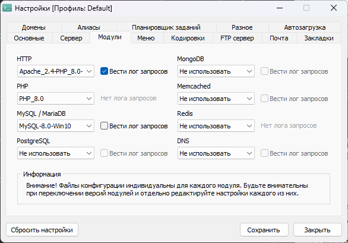

# test_stmd_jr

Тестовое задание Стармедиа

// PHP

Выполнено чтение данных из файлов json.

Использовано ООП - созданы два класса для Участников и результатов их заездов.

Предусмотрена возможность кастомной настройки участников и их заезды - Можно самостоятельно выбрать количество участников, выберутся рандомно, у участника есть вложенный массив с результатми их попыток, так же заполняется рандомно. Участники не повторяются.

Выводится таблица на главной странице, содержащая информацию об участниках и заездах. 

Почему был выбран метод передачи GET? При отправке данных куда-либо рекомендуется использовать метод POST, а при получении GET. Так в данном случае является тестовым и небольшим, было принято решение использовать GET для удобства отслеживания передаваемой информации.

// JavaScript

Можно выполнить сортировку по каждому заезду и итоговому результату с помощью JS

// SCSS

Стилизация выполенна с помощью SCSS, дополнительно сделан файл variables содержащий цвета, размеры шрифта, отступы.

// Инструкция по использованию

При запуске проекта использованы значения по количеству участников и заездов по-умолчанию (15 и 4 соотвественно, исходя из требований к заданию)

Почему было решено сделать рандомную выборку из общего массива участников (файл json). По условию "Организаторы провели соревнования по автогонкам. Всего зарегистрировалось
59 участников, но принять участие в соревнованиях смогли только 15." Изначально в файле было 15 участников, а не 59. Было принято решение добавить еще одного участника (меня, Skoda Octavia) для проверки. Рандом был использован по причине неявности условия. Таким образом можно указать количество участников, и они будут выбраны рандомно.

Таким же рандомным образом происходит выборка из массива попыток. Элемент массива содержить ключ - "id" и результат - "result". По условию "Заезды проходили в случайном порядке, каждому былодано по 4 попытки. Всего было проведено 60 заездов, а за каждую попытку участнику присваивались очки.". Так у участника рандомно заполен массив с попытками. 

С помощью формы можно выбрать количество участников и заездов. В случае если будет выполнена отправка формы с пустыми данными, будет получено сообщение о соотвествущей ошибке. 

Если будет введено отрицательное число, также выведится соообщение об ошибке

Нельзя выбрать больше участников, чем зарегистрировано. 

Можно выбрать любое количество заездов, рекомендуется выбирать не более 5000, иначе велик риск возникновения ошибки "out of memory"

Вид таблицы

Изначально пользователю видна страница с отсортированным списоком участников согласно их положению в рейтинге (php). Можно выполнить сортировку по заездам (клик по стоолбцу с заездом или итоговому), тогда участники таблицы отсортируются согласно их положению по конретному заезду (js).

В случае если пользователю нужно сделать таблицу с кастомными данными, он может ввести числовые значения в форму. Если все данные корректны то будет получено сообщение об успехе.

// Инструкция по развертыванию

Работа выполнялась с помощью OpenServer. Настройки 

